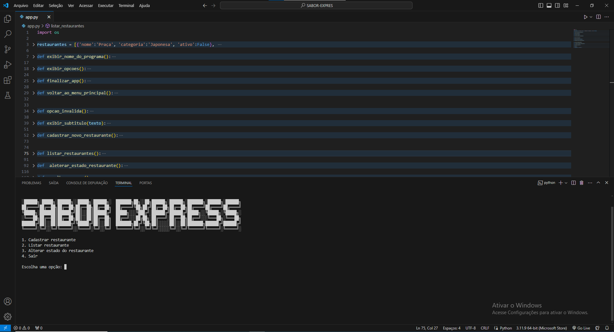
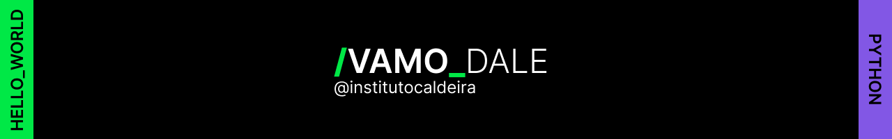

# sabor_express

## Ferramentas utilizadas:

* Back-end

* Python

## Feito por:

### Adam Kenzo

### Instagram: [https://www.instagram.com/adamkenz0/]

### LinkedIn: [https://www.linkedin.com/in/adam-kenzo-isa-bezerra-a08158278/]

## Certificados do curso: 

### Python: crie a sua primeira aplicação - [https://cursos.alura.com.br/certificate/adamkisa/python-crie-sua-primeira-aplicacao]

## Créditos do footer-readme: [@ambosdev](https://github.com/ambosdev)

###### Repositório criado para um dos projetos realizados através do programa sem fins lucrativos do [@Instituto Caldeira](https://www.instagram.com/institutocaldeira) na trilha de Python!
### Conteúdo didático disponibilizado no programa:
- [x] Lógica de Programação com JavaScript
- [x] Linguagem Python orientada a objetos + API
- [x] Variáveis, arrays, coleções e estruturas de controle

`JavaScript` `Python`
#### #ETERNOJEAN
